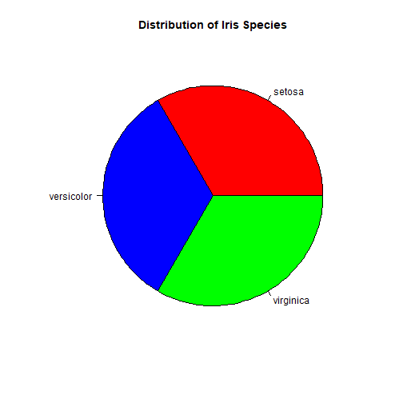

# AutoPlot Package

This package is designed for anyone who wants to quickly explore and visualize their data.
In statistics, we often deal with many types of plots, and setting them up one by one can be time-consuming.
**AutoPlot** helps you generate a variety of plots automatically, so you can quickly see what fits your dataset best.

After exploring the generated plots, you can choose the ones you like and configure them more precisely.

---

## Example

Suppose your dataset is the classic **iris** dataset.
Normally, you'd start by summarizing your data to decide which plots are suitable:

```r
summary(iris)
```

```
##   Sepal.Length    Sepal.Width     Petal.Length    Petal.Width          Species  
##  Min.   :4.300   Min.   :2.000   Min.   :1.000   Min.   :0.100   setosa    :50  
##  1st Qu.:5.100   1st Qu.:2.800   1st Qu.:1.600   1st Qu.:0.300   versicolor:50  
##  Median :5.800   Median :3.000   Median :4.350   Median :1.300   virginica :50  
##  Mean   :5.843   Mean   :3.057   Mean   :3.758   Mean   :1.199                  
##  3rd Qu.:6.400   3rd Qu.:3.300   3rd Qu.:5.100   3rd Qu.:1.800                  
##  Max.   :7.900   Max.   :4.400   Max.   :6.900   Max.   :2.500
```

You may also inspect a few rows:

```
##   Sepal.Length Sepal.Width Petal.Length Petal.Width Species
## 1          5.1         3.5          1.4         0.2  setosa
## 2          4.9         3.0          1.4         0.2  setosa
## 3          4.7         3.2          1.3         0.2  setosa
## 4          4.6         3.1          1.5         0.2  setosa
## 5          5.0         3.6          1.4         0.2  setosa
```

Or manually create plots such as:

```r
data(iris)
counts = table(iris$Species)
counts = counts[is.finite(counts)]

pie(counts,
    main = "Distribution of Iris Species",
    col = c("red", "blue", "green"))
```



---

## Installation

To install the package directly from GitHub:

```r
devtools::install_github("omidNomiri/AutoPlot")
```

---

## Usage

After installing the package, simply run:

```r
run_app()
```

Upload your dataset in **CSV format** and AutoPlot will generate a collection of plots for you.

Here is an example output using the iris dataset:


