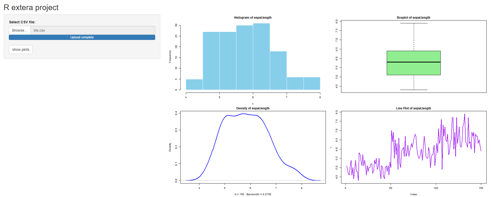

```yaml
---
title: "Auto Plot"
author: "Omid"
date: "2025-11-12"
runtime: shiny
output:
  html_document:
    df_print: paged
---
```

```{r setup, include=FALSE}
library(shiny)
library(Autoplot) 
knitr::opts_chunk$set(
  echo   = TRUE,
  warning = FALSE
)
```

## Auto Ploter

This is a R program for everyone who want extract plots, and in the world of statistics we have a lots of plots.
It is boring if you setup one by one to show what it is and how it looks for your data, so you run **Auto plot** program and see the result.
After seeing the result on your dataset, choose what you like and go for setup.

### Example

We say your dataset is **iris** dataset and we run auto ploter on it.

By default you summary your data and think what plot is good for your data.

```{r iris}
summary(iris)
```

You can see some data in here.

```{r show-data, echo=FALSE}

head(iris, 5)
```

or setup plots one by one like this:

```{r show-plot}
data(iris)
counts = table(iris$Species)
counts = counts[is.finite(counts)]

pie(counts,
    main = "Distribution of Iris Species",
    col = c("red", "blue", "green"))
```

But with this program you just say:

```{r use-case-of-auto-plot, eval=FALSE}
auto_plot(iris)
```

and here your result:



````
